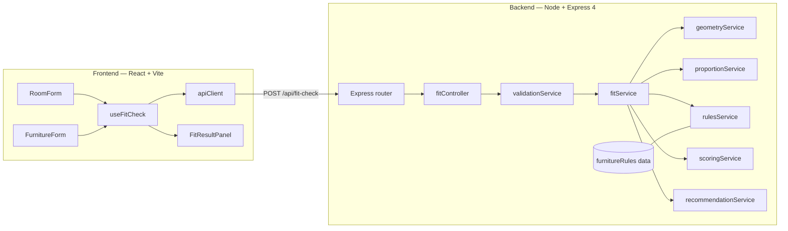
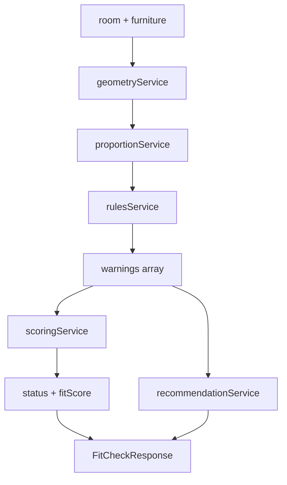
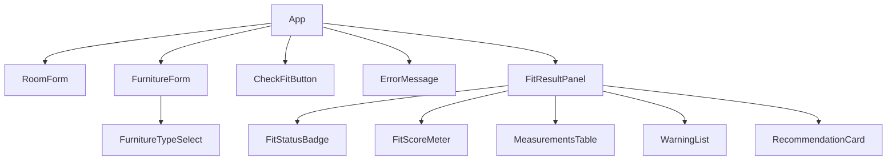
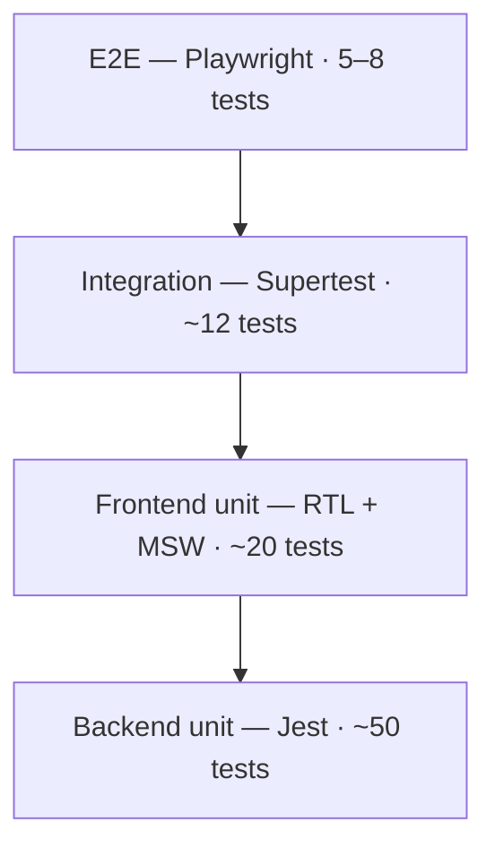

# DesignFit — Development Plan

> Furniture Fit Checker for interior design.
> This document is the agreed architecture and build plan for the MVP.

---

## 1. Problem Statement

Interior designers regularly need to answer a deceptively simple question: **is this piece of furniture the right size for this room?**

Today that question is answered with a tape measure, a sketch, and experience. It is easy to get wrong, and the mistakes are expensive — a sofa that technically fits but leaves no walking space, a dining table too narrow to seat people on both sides, a coffee table that swallows a small living room.

There are three separate questions hiding inside "does it fit", and conflating them is the root of most sizing mistakes:

| Question | What it checks | Example failure |
| --- | --- | --- |
| **Physical fit** | Does the footprint fit inside the room bounds? | A 240 cm sofa in a 220 cm wide room |
| **Proportion** | How much of the floor does it consume? | A sofa covering 45% of a small room |
| **Sizing appropriateness** | Does it respect design rules of thumb? | A dining table only 70 cm deep |

**DesignFit** answers all three from a handful of measurements, and returns a clear verdict: a fit status, a fit score, the underlying measurements, specific warnings, and one plain-language recommendation.

---

## 2. MVP Scope

The MVP evaluates **one furniture piece against one room** at a time.

### In scope

1. User enters a room name.
2. User enters room length and width.
3. User enters a furniture piece.
4. Furniture has: name, type, width, depth.
5. Supported furniture types: **sofa**, **coffee table**, **dining table**.
6. The application determines whether the furniture physically fits — including rotated 90°.
7. The application calculates furniture-to-room proportions.
8. The application evaluates basic interior design sizing rules.
9. The application returns: **fit status**, **fit score**, **measurements**, **warnings**, **recommendation**.

### Fixed decisions

These were ambiguous in the original requirements and are settled here so they do not need re-litigating mid-build:

| Decision | Choice | Rationale |
| --- | --- | --- |
| **Units** | Centimetres only, everywhere | Unit conversion is pure UI polish and adds a whole class of bugs |
| **Scale** | One room, one furniture piece per check | Multi-piece layout is a bin-packing problem — a different project |
| **Rotation** | Both orientations are checked automatically | A piece that fits rotated genuinely fits; reporting otherwise is wrong |
| **Clearance** | Included as a **warning**, never a hard fail | "Fits with zero walking space" is technically true and practically useless |
| **State** | None — the API is stateless | No database in the MVP, so there is nothing to persist |

---

## 3. Technology Stack

### Frontend

- **React 18** — UI library
- **JavaScript** (no TypeScript)
- **Vite** — dev server and build tool
- **Vitest + React Testing Library** — component tests
- **MSW** — API mocking in tests
- **axios** — HTTP client
- Plain CSS for styling

### Backend

- **Node.js**
- **Express 4** — REST API
- **Jest** — unit tests
- **Supertest** — integration tests
- `cors`, `morgan` middleware (already present)

### Tooling

- **npm workspaces** — monorepo
- **Playwright** — E2E tests, Chromium only
- **concurrently** — run both packages in development

### Explicitly not used in the MVP

TypeScript · authentication · database · cloud services · microservices · Redux · external AI APIs

> **Migration note:** the frontend package is currently scaffolded with Create React App (`react-scripts`). Phase 0 replaces it with Vite. CRA and Vite cannot coexist.

---

## 4. Application Architecture

A **stateless calculation API** with a **thin client**.

All domain logic lives on the backend. The frontend holds only form state and the most recent result. This is the single most important architectural decision in the plan, because it means the interesting logic — the fit engine — can be tested with plain function calls, with no browser, no rendering, and no HTTP.



### Layering rules

```
routes  →  controller  →  services  →  pure calculation modules
```

- **Only the controller knows about HTTP.** It never contains a formula.
- **Services take plain objects and return plain objects.** No `req`, no `res`.
- **Calculation modules are pure functions.** Same input, same output, no side effects.
- **Design rules are data, not code.** They live in one constants file, so adding a furniture type in V2 is a data edit rather than a new `if` branch.

### Request flow

1. User fills both forms and presses **Check Fit**.
2. `useFitCheck` posts `{ room, furniture }` to `/api/fit-check`.
3. Validation middleware rejects bad input with `400` and a field-keyed error object.
4. `fitService` orchestrates geometry → proportion → rules → scoring → recommendation.
5. The assembled result returns as `200 JSON`.
6. `FitResultPanel` renders status, score, measurements, warnings, recommendation.

---

## 5. Folder Structure

```
Furniture-Fit-Checker/
├── README.md
├── package.json                       # npm workspaces root
├── playwright.config.js
├── docs/
│   ├── DEVELOPMENT_PLAN.md
│   └── project-overview.md
├── packages/
│   ├── backend/
│   │   ├── package.json
│   │   ├── jest.config.js
│   │   ├── src/
│   │   │   ├── index.js               # server bootstrap, listen()
│   │   │   ├── app.js                 # express app, middleware, route mounting
│   │   │   ├── routes/
│   │   │   │   ├── index.js
│   │   │   │   ├── fitCheckRoutes.js
│   │   │   │   └── furnitureTypeRoutes.js
│   │   │   ├── controllers/
│   │   │   │   ├── fitCheckController.js
│   │   │   │   └── furnitureTypeController.js
│   │   │   ├── services/
│   │   │   │   ├── fitService.js              # orchestrator
│   │   │   │   ├── geometryService.js         # physical fit
│   │   │   │   ├── proportionService.js       # areas and ratios
│   │   │   │   ├── rulesService.js            # design rules → warnings
│   │   │   │   ├── scoringService.js          # warnings → score + status
│   │   │   │   └── recommendationService.js   # warnings → one sentence
│   │   │   ├── validation/
│   │   │   │   └── validateFitCheckRequest.js
│   │   │   ├── data/
│   │   │   │   └── furnitureRules.js          # the rules table
│   │   │   ├── constants/
│   │   │   │   ├── warningCodes.js
│   │   │   │   └── fitStatus.js
│   │   │   └── middleware/
│   │   │       └── errorHandler.js
│   │   └── __tests__/
│   │       ├── geometryService.test.js
│   │       ├── proportionService.test.js
│   │       ├── rulesService.test.js
│   │       ├── scoringService.test.js
│   │       ├── recommendationService.test.js
│   │       ├── fitService.test.js
│   │       ├── validateFitCheckRequest.test.js
│   │       └── integration/
│   │           ├── fit-check-api.test.js
│   │           └── furniture-types-api.test.js
│   └── frontend/
│       ├── package.json
│       ├── vite.config.js
│       ├── index.html                 # moves to package root for Vite
│       └── src/
│           ├── main.jsx               # entry
│           ├── App.jsx
│           ├── components/
│           │   ├── RoomForm.jsx
│           │   ├── FurnitureForm.jsx
│           │   ├── FurnitureTypeSelect.jsx
│           │   ├── CheckFitButton.jsx
│           │   ├── FitResultPanel.jsx
│           │   ├── FitStatusBadge.jsx
│           │   ├── FitScoreMeter.jsx
│           │   ├── MeasurementsTable.jsx
│           │   ├── WarningList.jsx
│           │   ├── RecommendationCard.jsx
│           │   └── ErrorMessage.jsx
│           ├── hooks/
│           │   └── useFitCheck.js
│           ├── services/
│           │   └── apiClient.js
│           ├── utils/
│           │   └── validation.js
│           ├── styles/
│           │   └── App.css
│           └── __tests__/
│               ├── RoomForm.test.jsx
│               ├── FurnitureForm.test.jsx
│               ├── FitResultPanel.test.jsx
│               ├── WarningList.test.jsx
│               ├── useFitCheck.test.jsx
│               └── App.test.jsx
├── shared/
│   └── fixtures/
│       └── fitCheckResponse.js        # contract fixture, used by both sides
└── tests/
    └── e2e/
        ├── pages/
        │   ├── HomePage.js
        │   └── ResultPanel.js
        └── fit-check-workflow.spec.js
```

**On `shared/fixtures/`:** one canonical example of the response shape, imported by backend integration tests and by the frontend MSW handlers. If the backend changes the shape, the frontend tests break immediately rather than silently drifting.

---

## 6. Data Model

All measurements are in **centimetres**, positive numbers.

### `Room`

```js
{
  name:   "Living Room",   // string, 1–100 chars
  length: 500,             // number > 0
  width:  400              // number > 0
}
```

### `Furniture`

```js
{
  name:  "Three-seater sofa",  // string, 1–100 chars
  type:  "sofa",               // "sofa" | "coffee table" | "dining table"
  width: 220,                  // number > 0
  depth: 90                    // number > 0
}
```

### `FitCheckRequest`

```js
{
  room:      { name, length, width },
  furniture: { name, type, width, depth }
}
```

### `FitCheckResponse`

```js
{
  status: "fits",              // "fits" | "tight" | "does-not-fit"
  fitScore: 82,                // integer 0–100

  measurements: {
    roomArea: 200000,          // cm²
    furnitureArea: 19800,      // cm²
    coveragePercentage: 9.9,   // furniture area as % of room area
    orientation: "as-entered", // "as-entered" | "rotated" | "none"
    remainingLengthMargin: 280,
    remainingWidthMargin: 310,
    recommendedClearance: 90,
    actualClearance: 280
  },

  warnings: [
    {
      code: "INSUFFICIENT_CLEARANCE",
      severity: "warning",          // "info" | "warning" | "critical"
      message: "Only 45 cm of walking space in front of the sofa; 90 cm is recommended."
    }
  ],

  recommendation: "This sofa fits comfortably. Consider centring it on the longest wall.",

  meta: {
    unit: "cm",
    room:      { name, length, width },
    furniture: { name, type, width, depth }
  }
}
```

### `ValidationErrorResponse`

```js
{
  error: "VALIDATION_ERROR",
  fields: {
    "room.width":       "must be a positive number",
    "furniture.type":   "must be one of: sofa, coffee table, dining table"
  }
}
```

### Why warnings are objects, not strings

A bare string forces tests to assert on English copy, so every wording tweak breaks the suite. With a `code`, tests assert on `INSUFFICIENT_CLEARANCE`, the UI styles by `severity`, and the `message` stays free to change. This is a small decision with a large payoff over the life of the project.

---

## 7. REST Endpoints

Base path: `/api`

| Method | Path | Purpose | Success | Errors |
| --- | --- | --- | --- | --- |
| `GET` | `/api/health` | Liveness check | `200` | — |
| `GET` | `/api/furniture-types` | Supported types and their rule metadata | `200` | `500` |
| `POST` | `/api/fit-check` | Evaluate one piece against one room | `200` | `400`, `500` |

### `GET /api/furniture-types`

Lets the UI build its dropdown from the server rather than hardcoding a list that can drift from the rules table.

```js
{
  types: [
    {
      id: "sofa",
      label: "Sofa",
      typicalWidth:  [180, 260],
      typicalDepth:  [80, 100],
      recommendedClearance: 90
    }
    // ...
  ]
}
```

### `POST /api/fit-check`

The only endpoint carrying domain logic. `POST` rather than `GET` because the payload is a nested object and the results are not meaningfully cacheable.

**Request** → `FitCheckRequest`
**Response** → `FitCheckResponse`

### Status code contract

| Code | When |
| --- | --- |
| `200` | Evaluation completed — **including when the furniture does not fit**. "Does not fit" is a successful answer, not an error. |
| `400` | Malformed input: missing fields, wrong types, non-positive numbers, unsupported furniture type |
| `500` | Unexpected server error |

---

## 8. Furniture Fit Engine

The engine is five pure modules behind one orchestrator. Each stage adds to a shared list of warnings; scoring reads that list at the end.



### 8.1 `geometryService` — does it physically fit?

Checks both orientations against the room bounds:

```
as-entered:  furniture.width ≤ room.width  AND  furniture.depth ≤ room.length
rotated:     furniture.depth ≤ room.width  AND  furniture.width ≤ room.length
```

Returns the first orientation that fits, `"none"` if neither does, and the leftover margins on each axis.

If the piece fits only when rotated, that is still a fit — but it emits `REQUIRES_ROTATION` as an `info` warning, because the designer should know.

### 8.2 `proportionService` — how much room does it take?

```
roomArea            = room.length × room.width
furnitureArea       = furniture.width × furniture.depth
coveragePercentage  = (furnitureArea / roomArea) × 100
wallRatio           = furniture.width / room.width
```

Coverage is the headline proportion figure. `wallRatio` catches the case of a piece that is fine by area but visually dominates one wall.

### 8.3 `rulesService` — is it appropriate?

Reads the rules table for the furniture type and emits warnings for each violation. No formulas are hardcoded here; the module is a generic evaluator over the table.

### 8.4 `scoringService` — how good is the fit?

Start at **100** and subtract weighted penalties:

| Finding | Penalty |
| --- | --- |
| `critical` warning | −40 |
| `warning` | −15 |
| `info` | −5 |

Clamp the result to `0–100`.

**Status derivation:**

| Condition | Status |
| --- | --- |
| Orientation is `"none"` | `does-not-fit` — **hard override, regardless of score** |
| Score ≥ 75 | `fits` |
| Score 40–74 | `tight` |
| Score < 40 | `does-not-fit` |

The hard override matters: a piece that physically cannot enter the room must never report `tight` just because it happened to pass the proportion checks.

### 8.5 `recommendationService` — what should I do?

Takes the highest-severity warning and maps its `code` to a template sentence. If there are no warnings, it returns a positive confirmation. Deterministic templates only — no AI in the MVP.

### 8.6 Warning codes

| Code | Severity | Meaning |
| --- | --- | --- |
| `EXCEEDS_ROOM_WIDTH` | critical | Too wide for the room in any orientation |
| `EXCEEDS_ROOM_LENGTH` | critical | Too long for the room in any orientation |
| `REQUIRES_ROTATION` | info | Fits only when rotated 90° |
| `INSUFFICIENT_CLEARANCE` | warning | Not enough walking or seating space around it |
| `HIGH_FLOOR_COVERAGE` | warning | Consumes too much of the floor area |
| `DOMINATES_WALL` | warning | Too wide relative to the wall it sits against |
| `OVERSIZED_FOR_TYPE` | warning | Larger than the typical range for this type |
| `UNDERSIZED_FOR_TYPE` | warning | Smaller than the typical range for this type |

---

## 9. Interior Design Sizing Rules

These are the designer heuristics the engine encodes. They live in **one file** — `src/data/furnitureRules.js` — as a plain data table.

### Rules table

| Rule | Sofa | Coffee table | Dining table |
| --- | --- | --- | --- |
| Typical width (cm) | 180–260 | 90–140 | 150–220 |
| Typical depth (cm) | 80–100 | 45–70 | 90–110 |
| Recommended clearance (cm) | 90 in front | 40 all sides | 90 all sides (chairs) |
| Max floor coverage | 25% | 10% | 20% |
| Max wall ratio | 0.75 | — | — |

### Shape

```js
const furnitureRules = {
  "sofa": {
    label: "Sofa",
    typicalWidth: [180, 260],
    typicalDepth: [80, 100],
    recommendedClearance: 90,
    clearanceNote: "walking space in front",
    maxFloorCoverage: 0.25,
    maxWallRatio: 0.75
  },
  "coffee table": { /* ... */ },
  "dining table": { /* ... */ }
};
```

### The reasoning behind each rule

- **Clearance in front of a sofa (90 cm)** — a person needs roughly 75–90 cm to walk past comfortably. Below that the room feels cramped even though everything "fits".
- **Dining table clearance (90 cm all sides)** — a dining chair needs about 60 cm to pull out, plus room to walk behind it. This is the rule most often violated in small dining rooms.
- **Coffee table clearance (40 cm)** — enough to step between the sofa and the table without shuffling sideways.
- **Dining table minimum depth (90 cm)** — narrower than this and place settings on opposite sides collide in the middle.
- **Max floor coverage** — furniture beyond roughly a quarter of the floor makes a room read as crowded, independent of whether it fits.
- **Max wall ratio** — a sofa spanning more than about three-quarters of its wall leaves no visual breathing room at the ends.

Encoding these as data has a practical consequence: a designer can tune the numbers without touching a line of logic, and every rule change is one diff in one file.

---

## 10. Frontend Components

### Component tree



### Responsibilities

| Component | Responsibility |
| --- | --- |
| `App` | Layout shell; owns room, furniture, and result state |
| `RoomForm` | Room name, length, width inputs |
| `FurnitureForm` | Furniture name, type, width, depth inputs |
| `FurnitureTypeSelect` | Type dropdown populated from `/api/furniture-types` |
| `CheckFitButton` | Submit; disabled while invalid or pending |
| `FitResultPanel` | Container for the response; renders nothing when idle |
| `FitStatusBadge` | Colour-coded `fits` / `tight` / `does-not-fit` |
| `FitScoreMeter` | 0–100 score as a bar |
| `MeasurementsTable` | Areas, coverage, orientation, margins, clearance |
| `WarningList` | Warning array, styled by `severity` |
| `RecommendationCard` | The single recommendation sentence |
| `ErrorMessage` | Validation failures and network errors |

### Supporting modules

- **`hooks/useFitCheck.js`** — owns the request lifecycle: `idle → loading → success | error`. Keeping this in a hook means `App` stays a layout component and the async behaviour is testable on its own.
- **`services/apiClient.js`** — a thin axios wrapper. The only file that knows the API base URL.
- **`utils/validation.js`** — mirrors the required-field checks for instant feedback. **The backend remains the authority**; this exists purely so the user is not waiting on a round trip to learn a field is blank.

### State management

`useState` in `App`, passed down as props. No Redux.

One form and one result do not justify a store, and introducing one here would add ceremony without removing any complexity. If the app later grows to multiple rooms and saved projects, revisit — but not before.

---

## 11. Backend Components

| Module | Responsibility | Pure? |
| --- | --- | --- |
| `app.js` | Express app, middleware, route mounting | — |
| `index.js` | Server bootstrap, `listen()` | — |
| `routes/fitCheckRoutes.js` | Path → controller wiring | — |
| `controllers/fitCheckController.js` | Unwrap request, call service, set status code | — |
| `validation/validateFitCheckRequest.js` | Shape, type, positivity, allowed-type checks | ✅ |
| `services/fitService.js` | Orchestrates the pipeline, assembles the response | ✅ |
| `services/geometryService.js` | Both-orientation fit check, margins | ✅ |
| `services/proportionService.js` | Areas, coverage, wall ratio | ✅ |
| `services/rulesService.js` | Evaluates the rules table → warnings | ✅ |
| `services/scoringService.js` | Warnings → score and status | ✅ |
| `services/recommendationService.js` | Warnings → one sentence | ✅ |
| `data/furnitureRules.js` | The rules table | data |
| `constants/warningCodes.js` | Warning code and severity constants | data |
| `middleware/errorHandler.js` | Catch-all → `500` | — |

Splitting `index.js` from `app.js` is what allows Supertest to import the app without ever binding a port — the existing code already does this correctly.

---

## 12. Testing Strategy

Four layers, each with a distinct job. The pyramid is deliberately bottom-heavy: the fit engine is where the value and the risk live, and it is the cheapest thing to test.



### Backend unit tests — `packages/backend/__tests__/`

The highest-value layer. One file per service, table-driven cases per furniture type:

- Exact fit — furniture dimensions equal room dimensions
- Fits only when rotated
- Over by 1 cm on each axis
- Zero, negative, and non-numeric input
- Each rule boundary tested at the value, one below, and one above
- Score clamping at both 0 and 100
- The `does-not-fit` hard override beating a high score

Target **full branch coverage** on `rulesService` and `scoringService`.

### Backend integration tests — `__tests__/integration/`

Jest + Supertest, real HTTP:

- Happy path for each of the three furniture types
- A piece that does not fit → `200` with `status: "does-not-fit"`
- Missing fields → `400` with the correct `fields` keys
- Wrong types and negative numbers → `400`
- Unsupported furniture type → `400`
- `GET /api/furniture-types` contract
- `GET /api/health`

### Frontend unit tests — `packages/frontend/src/__tests__/`

Vitest + React Testing Library, API mocked with MSW:

- Validation feedback on empty and invalid fields
- Submit disabled while the form is invalid or a request is pending
- Loading state renders
- Result renders correctly for each of the three statuses
- Warning list renders one entry per warning, styled by severity
- `400` and `500` responses surface through `ErrorMessage`

Query by role and label, not by CSS class — tests should survive restyling.

### E2E tests — `tests/e2e/`

Playwright, Chromium only, Page Object Model, **5–8 tests** covering critical journeys only:

1. Enter a room and a fitting sofa → `fits` with a high score
2. Enter an oversized sofa → `does-not-fit` with a critical warning
3. Enter a piece that fits only rotated → `fits` with `REQUIRES_ROTATION`
4. Enter a dining table with insufficient chair clearance → `tight` with a clearance warning
5. Submit with empty fields → blocked, validation shown
6. Backend unavailable → error surfaces gracefully

Each test must be independent and set up its own state.

### Contract discipline

`shared/fixtures/fitCheckResponse.js` is imported by both the backend integration tests and the frontend MSW handlers. This is the mechanism that stops the two halves of the app drifting apart — a shape change on one side fails tests on the other.

---

## 13. Development Phases

Each phase ends with a working, tested state. Nothing is left half-finished between phases.

### Phase 0 — Vite migration

Replace `react-scripts` with Vite and get the test setup working again.

- Remove `react-scripts`, add `vite` and `@vitejs/plugin-react`
- Move `index.html` to the package root, add the module script tag
- Create `vite.config.js` with the backend proxy to port 3030
- Switch tests to Vitest; port the existing `App.test.js`
- Rename JSX-containing files to `.jsx`
- **Done when:** dev server runs, the existing test passes

### Phase 1 — Rules data and geometry

The foundation of the engine.

- `data/furnitureRules.js` with all three types
- `constants/warningCodes.js`, `constants/fitStatus.js`
- `geometryService`, `proportionService` + unit tests
- **Done when:** both services are fully covered and the rules table is complete

### Phase 2 — Rules, scoring, orchestration

Complete the engine.

- `rulesService` as a generic evaluator over the table
- `scoringService` with penalties, clamping, and the hard override
- `recommendationService` with the template map
- `fitService` orchestrator
- Unit tests for all four
- **Done when:** `fitService` produces a correct full response from plain objects, with no HTTP involved

### Phase 3 — API surface

Expose the engine.

- `validation/validateFitCheckRequest.js`
- Controllers, routes, `errorHandler`
- Mount everything under `/api` in `app.js`
- `shared/fixtures/fitCheckResponse.js`
- Integration tests
- **Done when:** all three endpoints respond correctly to valid and invalid input

### Phase 4 — Frontend forms and API wiring

- `apiClient`, `useFitCheck`
- `RoomForm`, `FurnitureForm`, `FurnitureTypeSelect`, `CheckFitButton`
- `utils/validation.js`, `ErrorMessage`
- Component tests with MSW
- **Done when:** a request can be sent from the UI and the raw response logged

### Phase 5 — Result rendering

- `FitResultPanel` and its five children
- Styling and severity colours
- Component tests for all three statuses
- **Done when:** the full round trip renders a readable result

### Phase 6 — E2E and polish

- Page objects and the E2E suite
- Accessible labels, keyboard navigation, focus management
- README update with run instructions
- **Done when:** `npm run test:all` passes clean

---

## 14. Out of Scope

Not built, and not designed for, in the MVP:

| Excluded | Why |
| --- | --- |
| **TypeScript** | Specified constraint; keeps the learning focus on architecture |
| **Authentication** | No user-specific data exists to protect |
| **Database** | The API is stateless; nothing needs persisting |
| **Cloud services** | Runs locally; deployment is not part of the MVP |
| **Microservices** | One small API — splitting it would be pure overhead |
| **Redux** | One form, one result; `useState` is sufficient |
| **External AI APIs** | Recommendations are deterministic templates |
| **Multiple furniture pieces at once** | Bin packing — a substantially larger problem |
| **Furniture positioning / layout** | Requires coordinates, collision detection, and a canvas |
| **Non-rectangular rooms** | L-shapes, alcoves, and bays need polygon geometry |
| **Doors and windows** | Changes clearance rules and swing-path calculations |
| **Height / 3D** | Requirements specify width and depth only |
| **Unit switching** | Fixed to centimetres |
| **Saving projects** | Needs the excluded database |

---

## 15. Version 2 Ideas

Roughly in order of value per unit of effort.

### High value, low effort

- **Additional furniture types** — armchair, bed, bookcase, sideboard. The rules table makes this a data-only change.
- **Unit switching** — cm / inches / feet, converting at the UI boundary only.
- **Shareable result links** — encode the inputs in the URL query string.
- **Comparison mode** — evaluate two candidate pieces side by side.

### High value, higher effort

- **Multiple pieces in one room** — total coverage, combined clearance, conflict detection between pieces.
- **2D floor plan visualisation** — draw the room to scale with the furniture footprint on it. The single biggest usability win.
- **Drag-to-position** — place furniture on the plan and get position-aware clearance feedback.
- **Doors and windows** — swing paths, walkways, and "do not block" zones.
- **Room templates** — standard sizes for common room types.

### Requires excluded infrastructure

- **Saved projects and rooms** — needs a database.
- **User accounts and sharing** — needs authentication.
- **Furniture catalogue** — real product dimensions from retailer data.
- **AI-generated recommendations** — natural-language advice from an LLM, replacing the template map.
- **PDF export** — a client-ready summary sheet.

### Depth improvements

- **Non-rectangular rooms** — polygon geometry.
- **Height and 3D volume** — ceiling height, sightlines, visual weight.
- **Accessibility compliance** — wheelchair turning circles and regulated clearances.
- **Style and scale guidance** — proportion advice beyond raw measurement.
- **Undo / redo** and input history.

---

## Appendix — Quick Reference

### Commands

```bash
npm install              # install all workspaces
npm run start            # frontend + backend together
npm run test             # unit tests, both packages
npm run test:integration # backend integration tests
npm run test:e2e         # Playwright suite
npm run test:all         # everything
```

### Ports

| Service | Port |
| --- | --- |
| Frontend (Vite) | 5173 |
| Backend (Express) | 3030 |

### Key architectural decisions

1. **All domain logic on the backend** — makes the engine testable without a browser.
2. **Design rules as data, not code** — new types and tuned numbers are data edits.
3. **Warnings carry codes, not just strings** — tests assert on codes, UI styles on severity.
4. **Rotation checked automatically** — a piece that fits rotated genuinely fits.
5. **Clearance warns, never fails** — the designer decides what is acceptable.
6. **Shared response fixture** — the frontend and backend cannot drift apart silently.
